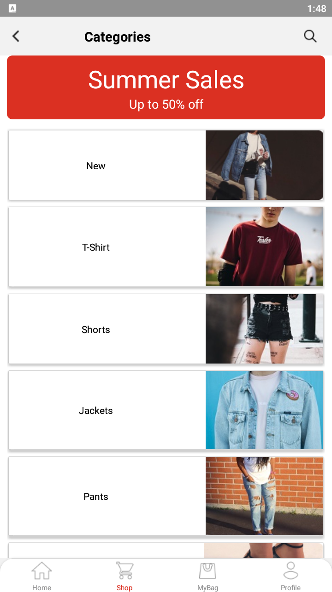

# blanjaMobile

<div align="center">
</div>

## Contents

- [Description](#description)
- [Features](#features)
- [Requirements](#requirements)
- [Installation](#installation)
- [ENV](#ENV)
- [Usage](#Usage)
- [Screenshoots](#screenshoots)
- [Demo](#demo)
- [Related Project](#related-project)
- [License](#license)

## Description

An E-commerce website thar we can buy and sell new or used goods called Blanja Mobile version which is created using React Native.

## Features

- Search Product
- Add Product
- Edit Product
- Edit Profile
- etc

### Requirements

- [`Node Js`](https://nodejs.org/en/)
- [`npm`](https://www.npmjs.com/get-npm)
- [`ReactJs`](https://reactjs.org/)
- [`Blanja API`](https://github.com/bayue48/blanja-api.git)

### Installation

1. Clone the repo
   ```sh
   git clone https://github.com/bayue48/blanja-mobile.git
   ```
2. Install NPM packages
   ```sh
   npm install
   ```
   This will install the dependencies inside `node_modules`
   
### ENV

Please create and make the changes in the .env file.

```bash
API_URL = "http://host_backend:port_backend"
```

Example :

```bash
API_URL = "http://localhost:4000"
```

### Usage

`npx react-native run-android`.

Runs the app in the development mode.<br>
Open [http://localhost:3000/](http://localhost:3000/) to view it in the browser.

If you want to build, type `npm run build`.

## Screenshoots

<div align="center">
   
</div>

## Demo

This is Blanja Web build version, let's try it.

[http://](http://)

## Related Project

RESTful API for this web application, clone this for development.

<a href="https://github.com/bayue48/blanja-api.git">REST API</a>

## License

Distributed under the [MIT](https://github.com/bayue48/blanja-mobile/blob/master/LICENSE) License.
